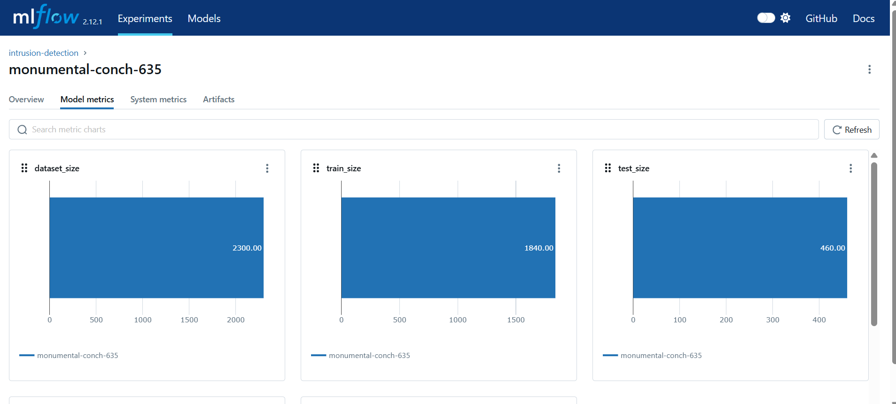
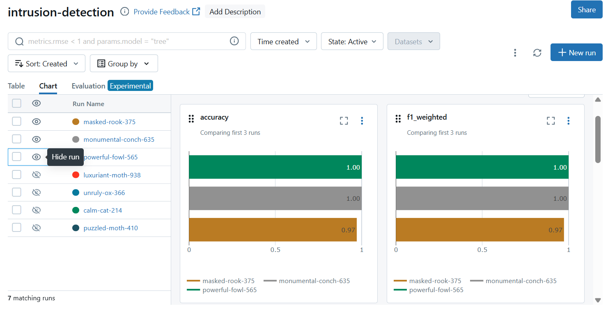

# Kafka–Spark Streaming Pipeline

A real-time cybersecurity data pipeline built with Kafka and Spark that processes network events, stores partitioned data, and automatically retrains an intrusion detection model based on new incoming data.

## Problem

Modern security systems generate massive volumes of network events that must be processed reliably in real time for monitoring, analytics, and machine learning.

This architecture is designed to scale horizontally and can support **millions of events per minute** using Kafka ingestion and distributed Spark streaming.

## Dataset

This project uses the **UNSW-NB15 network flow dataset**, a cybersecurity dataset containing detailed network traffic features such as ports, packet counts, bytes, and flow duration.

## Input

Network flow records streamed as events into a Kafka topic.

## Output

Processed events stored as **partitioned Parquet files** by date and hour for scalable analytics.

---

# Architecture

```
           +----------------------+
           |   UNSW-NB15 Dataset  |
           |  Network Flow Events |
           +----------+-----------+
                      |
                      v
           +----------------------+
           |     Kafka Producer   |
           |  Streams JSON events |
           +----------+-----------+
                      |
                      v
           +----------------------+
           |      Kafka Topic     |
           |  Distributed Queue   |
           +----------+-----------+
                      |
                      v
           +----------------------+
           | Spark Structured     |
           | Streaming Engine     |
           |                      |
           | Micro-batch: 100     |
           | Trigger: 5 seconds   |
           | Checkpointing        |
           +----------+-----------+
                      |
                      v
           +----------------------+
           | Partitioned Parquet  |
           |  Data Lake Storage   |
           | date / hour          |
           +----------+-----------+
                      |
                      v
           +----------------------+
           | Retraining Watcher   |
           | Monitors partitions  |
           | Detects new data     |
           +----------+-----------+
                      |
                      v
           +----------------------+
           |   Model Training     |
           | Random Forest Model  |
           +----------+-----------+
                      |
                      v
           +----------------------+
           |   Versioned Models   |
           |  Model Artifacts     |
           |  metrics / features  |
           +----------------------+

```
---
## Data Lake Structure

Processed events are stored as **partitioned Parquet files** in a data lake layout.

```text
output/
  unsw_stream/
    date=YYYY-MM-DD/
      hour=HH/
        part-xxxxx.parquet
```

## Partitioning

Data is partitioned by **date** and **hour** based on the processing timestamp.

## File Format

Data is stored in **Parquet**, a columnar format optimized for large-scale analytics.

## Streaming Writes

Spark Structured Streaming continuously appends new files to the correct partition for each micro-batch.

---

# Pipeline Stages

**Dataset**
Structured network flow records used to simulate real-time network telemetry.

**Kafka Producer**
Reads rows from the dataset and streams them as JSON events to Kafka.

**Kafka Topic**
Acts as a durable event queue buffering incoming data.

**Spark Structured Streaming**
Consumes events from Kafka and processes them in micro-batches.

**Parquet Storage**
Writes processed events into a partitioned data lake for efficient querying.

---

# Streaming Configuration

**Batch size**
maxOffsetsPerTrigger = 100 events per batch.

**Processing interval**
trigger(processingTime = 5 seconds).

**Fault tolerance**
Spark checkpoints store offsets to allow recovery after failures.

---
Why This Architecture Scales to Millions of Events per Minute

**Kafka ingestion layer**
Kafka can ingest very large streams of events using distributed brokers and topic partitions.

**Decoupled producer and consumer**
Kafka buffers events so producers and processors can scale independently.

**Parallel stream processing**
Spark processes events in parallel across multiple cores or machines.

**Micro-batch streaming**
Spark handles data in small batches which stabilizes processing under high load.

**Backpressure control**
`maxOffsetsPerTrigger` limits how many events are processed per batch.

**Fault tolerance**
Checkpointing allows Spark to recover from failures without losing data.

**Scalable storage**
Partitioned Parquet storage supports efficient querying on large datasets.

---
## Model Training

### Data

Training uses processed flow records derived from the **UNSW-NB15 dataset**, a widely used benchmark for network intrusion detection.

The data is generated by the **Kafka → Spark streaming pipeline** and stored as partitioned Parquet files:

```
/app/output/unsw_stream/
```

Spark continuously writes the processed events into time-based partitions:

```
output/unsw_stream/
    date=2026-03-16/
        hour=13/
        hour=14/
    date=2026-03-17/
    date=2026-03-18/
```

The partition hierarchy is organized by **date → hour**.
Each actual data partition corresponds to a specific date and hour combination, for example:

```
date=2026-03-16/hour=13
date=2026-03-16/hour=14
```

### Model

The system trains a **Random Forest classifier** with balanced class weights to handle the class imbalance typical in intrusion detection datasets.

### Training Process

1. Load Parquet partitions produced by Spark
2. Validate required columns
3. Split the dataset into train and test sets
4. Train the Random Forest model
5. Evaluate predictions

### Example Training Output

```
Training on full dataset: /app/output/unsw_stream

Classification report:
              precision    recall  f1-score   support

           0       1.00      1.00      1.00     10795
           1       0.99      0.99      0.99       845

    accuracy                           1.00     11640
   macro avg       0.99      0.99      0.99     11640
weighted avg       1.00      1.00      1.00     11640

Confusion matrix:
[[10786     9]
 [    8   837]]

Saved model to:
/app/models/2026-03-16-15-02-50/intrusion_model.joblib
```

### Model Artifacts

Each training run stores versioned artifacts:

```
models/
   2026-03-16-15-02-50/
       intrusion_model.joblib
       intrusion_model.metrics.json
       intrusion_model.features.json
```
---

## Automatic Retraining

The system includes an automatic retraining mechanism triggered by new incoming data partitions.

### How it works

* Spark streaming writes processed data into **time-based partitions**:

  ```
  /app/output/unsw_stream/date=YYYY-MM-DD/hour=HH
  ```

* A dedicated **training service (watcher)** continuously monitors the output directory.

* When a new partition is detected:

  * The system **automatically triggers model retraining**
  * Training runs on the **latest completed partition** (to avoid partial data)

---

### Demo

#### 1. Start the training watcher

```bash
docker compose up training
```

---

#### 2. Simulate new incoming data

```bash
docker exec -it spark bash
cp -r /app/output/unsw_stream/date=2026-03-19 /app/output/unsw_stream/date=2026-03-20
```

---

#### 3. Automatic retraining is triggered

```text
Training on partition: /app/output/unsw_stream/date=2026-03-20/hour=13

Classification report:
              precision    recall  f1-score   support

           0       1.00      1.00      1.00       447
           1       1.00      1.00      1.00        13

    accuracy                           1.00       460

Confusion matrix:
[[447   0]
 [  0  13]]

Saved model to: /app/models/2026-03-17-14-16-22/intrusion_model.joblib
```
---

## Retraining Flow

The automatic retraining mechanism is implemented via a lightweight watcher service.

1. **Container startup**

```python
CMD ["python", "retrain_watcher.py"]
```

The training container runs a watcher script continuously.

---

2. **Monitoring loop**

```python
while True:
    partitions = set(get_partitions())
    new_partitions = partitions - known_partitions
```

The system continuously scans for new data partitions.
New folders act as the **trigger** for retraining.

---

3. **New data detection**

```python
if new_partitions:
    print("New partitions detected:", new_partitions)
```

When new data is detected, the system initiates retraining.

---

4. **Selecting stable data**

```python
sorted_parts = sorted(partitions)
previous_partition = sorted_parts[-2]
```

Training is performed on the **latest completed partition**,
avoiding partially written data.

---

5. **Triggering training**

```python
subprocess.run(["python", "train.py"])
```

This command executes the training pipeline and produces a new model.

---

### Training Strategy

* The system does not train on the newest partition
* **It trains on the previous (fully completed) partition**

This ensures the model is trained only on stable, fully written data, avoiding partial or incomplete streaming inputs.

---

## MLflow Tracking

The project uses MLflow for experiment tracking, enabling full visibility into model training, evaluation, and data versioning.

### Key Features

- **Time-based training**
  - Train on: `date=YYYY-MM-DD/hour=t`
  - Test on: `date=YYYY-MM-DD/hour=t+1`

- **Logged Parameters**
  - `n_estimators`, `test_size`, `random_state`

- **Logged Metrics**
  - Accuracy, Precision, Recall, F1-score
  - Dataset size, train/test split

- **Tags**
  - `model_type`: RandomForest  
  - `feature_version`: v1  
  - `data_partition`: current training partition  
  - `evaluation_partition`: next hour  

### MLflow UI



---
### Data Leakage Fix – MLflow Runs Comparison

The MLflow experiment below shows multiple training runs before and after fixing a data leakage issue.



#### Key Observations

- Early runs achieved perfect scores (accuracy and F1 = 1.00), indicating potential data leakage
- These runs were based on random train/test splits on time-based data

#### Fix Applied

- Switched to time-based evaluation:
  - Train: `hour = t`
  - Test: `hour = t+1`

#### Result

- Performance dropped to realistic levels (~0.97 accuracy)
- The evaluation now reflects real-world streaming conditions
---

## Deployment

The system runs using **Docker Compose** and can be deployed on distributed infrastructure such as Kubernetes or cloud platforms.

---

## Monitoring

Streaming performance can be monitored through the **Spark UI**, which exposes metrics such as batch duration, input rows, and processing latency.

---

## Fault Tolerance

Spark **checkpointing** stores Kafka offsets and streaming state, allowing the pipeline to resume processing after failures without data loss.

---

## Backpressure Control

Backpressure is controlled using `maxOffsetsPerTrigger`, which limits how many events Spark consumes per micro-batch and prevents overload during traffic spikes.

---

## Quick Start

### Clean Environment and Rebuild

```bash
# stop containers and remove volumes
docker compose down -v

# rebuild images from scratch
docker compose build --no-cache

# start the full pipeline
docker compose up
```

### View Logs

```bash
docker compose logs spark
docker compose logs producer
```

### Clean Streaming Output

If the streaming job needs to be restarted from a clean state:

```bash
docker exec -it spark bash
rm -rf /app/output/*
rm -rf /app/checkpoints/*
exit
```

### Inspect Data with Spark

You can inspect the generated Parquet data using the Spark shell.

```bash
docker exec -it spark bash
/opt/spark/bin/pyspark
```

Example query:

```python
df = spark.read.parquet("/app/output/unsw_stream")
df.show(2)
```

### Run Model Training

After the streaming pipeline has produced data, the training job can be executed:

```bash
docker compose down training
docker compose build training
docker compose up training
```

The training job reads the generated Parquet partitions and trains the intrusion detection model.
