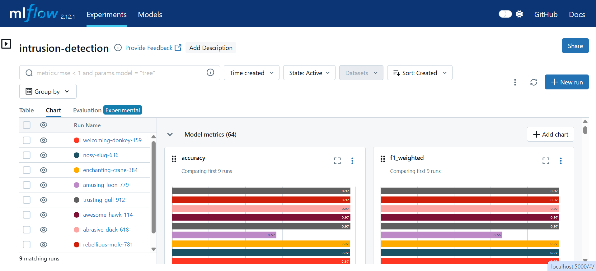
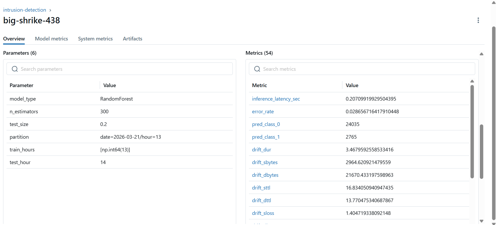

# Real-Time Intrusion Detection Pipeline (Kafka, Spark, MLflow + Model Registry, Auto-Retraining)

## MLflow Retraining & Production Promotion Demo

▶ Watch the video (click the image below)

[](https://youtu.be/H85fJlSiw10)

A production-style real-time ML pipeline for intrusion detection built with Kafka and Spark Structured Streaming. 

The system ingests network events, processes them into partitioned data for scalable analytics, and automatically retrains models on new incoming data. 

Integrated with MLflow for experiment tracking, monitoring, and model versioning, including a Model Registry with automated promotion based on performance.

## Problem

Modern security systems generate massive volumes of network events that must be processed reliably in real time for monitoring, analytics, and machine learning.

This architecture is designed for horizontal scalability using Kafka ingestion, Spark streaming, and partitioned storage.

## Dataset

This project uses the **UNSW-NB15 network flow dataset**, a cybersecurity dataset containing detailed network traffic features such as ports, packet counts, bytes, and flow duration.

## Input

Network flow records streamed as events into a Kafka topic.

## Output

Processed events stored as **partitioned Parquet files** by date and hour for scalable analytics.

---

# Architecture

```
           +----------------------+
           |   UNSW-NB15 Dataset  |
           |  Network Flow Events |
           +----------+-----------+
                      |
                      v
           +----------------------+
           |     Kafka Producer   |
           |  Streams JSON events |
           +----------+-----------+
                      |
                      v
           +----------------------+
           |      Kafka Topic     |
           |  Distributed Queue   |
           +----------+-----------+
                      |
                      v
           +----------------------+
           | Spark Structured     |
           | Streaming Engine     |
           |                      |
           | Micro-batch: 100     |
           | Trigger: 5 seconds   |
           | Checkpointing        |
           +----------+-----------+
                      |
                      v
           +----------------------+
           | Partitioned Parquet  |
           |  Data Lake Storage   |
           | date / hour          |
           +----------+-----------+
                      |
                      v
           +----------------------+
           | Retraining Watcher   |
           | Monitors partitions  |
           | Detects new data     |
           +----------+-----------+
                      |
                      v
           +----------------------+
           |   Model Training     |
           |     XGBoost Model    |
           | + Threshold Tuning   |
           +----------+-----------+
                      |
          +-----------+------------+
          |                        |
          v                        v
+----------------------+   +----------------------+
|        MLflow        |   |     Monitoring       |
|  Experiment Tracking |   | Metrics & Drift      |
|                      |   |                      |
| Params / Metrics     |   | Accuracy / F1        |
| Threshold / PR Curve |   | Latency              |
| Model Versions       |   | Prediction Dist      |
| Data Partitions      |   | Data Drift           |
+----------+-----------+   +----------+-----------+
           |
           v
+----------------------+
|  Model Registry      |
|  Staging → Production|
|  Auto Promotion      |
+----------+-----------+
           |
           v
+----------------------+
|   Versioned Models   |
|  Model Artifacts     |
| metrics / features   |
+----------------------+
```
---

## Notebooks (EDA)

The `notebooks/` directory contains exploratory data analysis used to understand the dataset before training.

Includes:

* Feature and label distributions
* Class imbalance analysis
* Time-based behavior (by hour/date)

Example:
`01_dataset_familiarization_unsw_nb15.ipynb` – initial dataset exploration and validation.

---
## Data Lake Structure

Processed events are stored as **partitioned Parquet files** in a data lake layout.

```text
output/
  unsw_stream/
    date=YYYY-MM-DD/
      hour=HH/
        part-xxxxx.parquet
```

## Partitioning

Data is partitioned by **date** and **hour** based on the processing timestamp.

## File Format

Data is stored in **Parquet**, a columnar format optimized for large-scale analytics.

## Streaming Writes

Spark Structured Streaming continuously appends new files to the correct partition for each micro-batch.

---

# Pipeline Stages

**Dataset**
Structured network flow records used to simulate real-time network telemetry.

**Kafka Producer**
Reads rows from the dataset and streams them as JSON events to Kafka.

**Kafka Topic**
Acts as a durable event queue buffering incoming data.

**Spark Structured Streaming**
Consumes events from Kafka and processes them in micro-batches.

**Parquet Storage**
Writes processed events into a partitioned data lake for efficient querying.

---

# Streaming Configuration

**Batch size**
maxOffsetsPerTrigger = 100 events per batch.

**Processing interval**
trigger(processingTime = 5 seconds).

**Fault tolerance**
Spark checkpoints store offsets to allow recovery after failures.

---
## Why This Architecture Scales

**Kafka ingestion layer**
Kafka can ingest very large streams of events using distributed brokers and topic partitions.

**Decoupled producer and consumer**
Kafka buffers events so producers and processors can scale independently.

**Parallel stream processing**
Spark processes events in parallel across multiple cores or machines.

**Micro-batch streaming**
Spark handles data in small batches which stabilizes processing under high load.

**Backpressure control**
`maxOffsetsPerTrigger` limits how many events are processed per batch.

**Fault tolerance**
Checkpointing allows Spark to recover from failures without losing data.

**Scalable storage**
Partitioned Parquet storage supports efficient querying on large datasets.

---
## Model Training

### Data

Training uses processed flow records derived from the **UNSW-NB15 dataset**, a widely used benchmark for network intrusion detection.

The data is generated by the **Kafka → Spark streaming pipeline** and stored as partitioned Parquet files:

```
/app/output/unsw_stream/
```

Spark continuously writes the processed events into time-based partitions:

```
output/unsw_stream/
    date=2026-03-16/
        hour=13/
        hour=14/
    date=2026-03-17/
    date=2026-03-18/
```

The partition hierarchy is organized by **date → hour**.
Each actual data partition corresponds to a specific date and hour combination, for example:

```
date=2026-03-16/hour=13
date=2026-03-16/hour=14
```

### Model

The system trains a **XGBoost classifier** with balanced class weights to handle the class imbalance typical in intrusion detection datasets.

### Training Process

1. Load Parquet partitions produced by Spark
2. Validate required columns
3. Split data using time-based partitioning:
   - Train on past partitions (hour = t)
   - Test on the next unseen partition (hour = t+1)
4. Train the XGBoost model
5. Evaluate predictions

### Example Training Output

```
Training on partition: /app/output/unsw_stream/date=2026-03-21/hour=13
Loading full date: /app/output/unsw_stream/date=2026-03-21
Loading /app/output/unsw_stream/date=2026-03-21/hour=13
Loading /app/output/unsw_stream/date=2026-03-21/hour=14

Train hours: [13]
Test hour: 14

Chosen threshold: 0.9958533048629761
Precision at threshold: 0.7332082551594746

Classification report:
              precision    recall  f1-score   support

           0       1.00      0.97      0.98     24755
           1       0.73      0.96      0.83      2045

    accuracy                           0.97     26800
   macro avg       0.86      0.96      0.91     26800
weighted avg       0.98      0.97      0.97     26800

Confusion matrix:
[[24044   711]
 [   92  1953]]

Model version 8 moved to Staging
Model version 8 promoted to Production
```

---

## Imbalanced Data Handling

The dataset is naturally imbalanced (benign ≫ attack), reflecting real-world network traffic.

Class balancing techniques (such as oversampling or undersampling) were intentionally avoided because they can distort the data distribution and lead to unrealistic model behavior, especially increasing false positives in production.

Instead, imbalance is handled using:

* Threshold optimization
* Precision-recall tradeoff

This ensures the model remains aligned with real-world conditions.

---

## Threshold Optimization

Instead of using a default classification threshold (0.5), the model selects a threshold based on the precision-recall curve.

Goal:

* Maintain high recall (~0.95) to minimize missed attacks
* Ensure minimum precision (~0.70) to control false positives

This aligns with cybersecurity requirements where detecting attacks is more critical than avoiding false alarms.

---

### MLflow Model Registry (Staging → Production)


The latest model version is automatically promoted to Production, while previous versions remain in Staging for comparison and rollback.
---

### Model Artifacts

Each training run stores versioned artifacts:

```
models/
   2026-03-16-15-02-50/
       intrusion_model.joblib
       intrusion_model.metrics.json
       intrusion_model.features.json
```
---

## Automatic Retraining

The system includes an automatic retraining mechanism triggered by new incoming data partitions.

### How it works

* Spark streaming writes processed data into **time-based partitions**:

  ```
  /app/output/unsw_stream/date=YYYY-MM-DD/hour=HH
  ```

* A dedicated **training service (watcher)** continuously monitors the output directory.

* When a new partition is detected:

  * The system **automatically triggers model retraining**
  * Training runs on the **latest completed partition** (to avoid partial data)

---

### Demo

#### 1. Start the training watcher

```bash
docker compose up training
```

---

#### 2. Simulate new incoming data

```bash
docker exec -it spark bash
cp -r /app/output/unsw_stream/date=2026-03-19 /app/output/unsw_stream/date=2026-03-20
```

---

#### 3. Automatic retraining is triggered

## Retraining Flow

The automatic retraining mechanism is implemented via a lightweight watcher service.

1. **Container startup**

```python
CMD ["python", "retrain_watcher.py"]
```

The training container runs a watcher script continuously.

---

2. **Monitoring loop**

```python
while True:
    partitions = set(get_partitions())
    new_partitions = partitions - known_partitions
```

The system continuously scans for new data partitions.
New folders act as the **trigger** for retraining.

---

3. **New data detection**

```python
if new_partitions:
    print("New partitions detected:", new_partitions)
```

When new data is detected, the system initiates retraining.

---

4. **Selecting stable data**

```python
sorted_parts = sorted(partitions)
previous_partition = sorted_parts[-2]
```

Training is performed on the **latest completed partition**,
avoiding partially written data.

---

5. **Triggering training**

```python
subprocess.run(["python", "train.py"])
```

This command executes the training pipeline and produces a new model.

---

### Training Strategy

* The system does not train on the newest partition
* **It trains on the previous (fully completed) partition**

This ensures the model is trained only on stable, fully written data, avoiding partial or incomplete streaming inputs.

---

## MLflow Tracking

The project uses MLflow for experiment tracking, enabling full visibility into model training, evaluation, and data versioning.


### MLflow UI

### MLflow Experiments Overview



The MLflow dashboard provides a comparison of multiple training runs, including accuracy and F1-score across different model versions.

Consistent performance (~0.97 accuracy and F1) across runs indicates stable training behavior after fixing data leakage and applying time-based evaluation.

---

## Monitoring Metrics

- **Accuracy / F1**
  - Accuracy: ~0.97  
  - Error rate: ~2.8%  
  → Strong performance with realistic errors (no data leakage)

- **Inference Latency**
  - ~0.2 sec per batch  
  → Reasonable for offline batch inference

- **Data Drift**
  - drift_sbytes ≈ 2.9K  
  - drift_dbytes ≈ 21K  
  - drift_sload ≈ 6.6M  
  - drift_stcpb ≈ 147M  

  → Significant differences between train and test data  
  → The test distribution is not identical to training  

  **Interpretation:**
  - ✔ Realistic: reflects changing conditions in streaming environments  
  - ❗ Challenging: makes the prediction task harder

All metrics are logged to MLflow under **offline monitoring mode**.

## MLflow Monitoring Dashboard

### Model Metrics Overview


### Full Metrics Table


---

## Imbalanced Data Handling & Cyber-Security Metrics

The dataset is highly imbalanced, with significantly more normal traffic than attack samples. This reflects real-world network conditions, where malicious events are rare.

Instead of applying class balancing techniques (e.g., oversampling or undersampling), the model handles imbalance using:

* **Class weighting (`scale_pos_weight`)** during training
* **Threshold tuning** to control the trade-off between recall and precision

Class balancing was intentionally avoided because it can distort the data distribution and lead to unrealistic performance, especially increasing false positives in production.

### Evaluation Strategy

In cybersecurity, missing an attack (false negative) is far more critical than raising false alerts. Therefore, model evaluation is focused on the **attack class (positive class)** rather than global averages.

The promotion criteria prioritize:

* **High Recall (≥ 0.95)** – to minimize missed attacks
* **Minimum Precision (≥ 0.70)** – to control alert noise
* **Latency constraints** – to ensure real-time performance

Metrics such as macro or weighted averages are not used for decision-making, as they can hide poor performance on the minority attack class.

This approach ensures that the model aligns with real-world security requirements rather than optimizing for generic ML metrics.

---

## Handling Large-Scale Data

Using all historical data for training is often not feasible due to memory, latency, and compute constraints.

This project applies a **time-aware training strategy**:

- Training is performed on recent data partitions (by hour)
- Evaluation is done on the next unseen time window
- Data is incrementally accumulated and retrained periodically

This approach:
- Reflects real-world streaming conditions
- Handles concept drift
- Keeps training efficient and scalable

---

## Deployment

The system runs using **Docker Compose** and can be deployed on distributed infrastructure such as Kubernetes or cloud platforms.

---

## Fault Tolerance

Spark **checkpointing** stores Kafka offsets and streaming state, allowing the pipeline to resume processing after failures without data loss.

---

## Backpressure Control

Backpressure is controlled using `maxOffsetsPerTrigger`, which limits how many events Spark consumes per micro-batch and prevents overload during traffic spikes.

---
## Key Capabilities

- Real-time ingestion using Kafka
- Stream processing with Spark Structured Streaming
- Partitioned Parquet data lake (date/hour)
- Automatic retraining on new data partitions
- Time-based model evaluation to prevent data leakage
- MLflow experiment tracking and model versioning
---
## Quick Start

### Clean Environment and Rebuild

```bash
# stop containers and remove volumes
docker compose down -v

# rebuild images from scratch
docker compose build --no-cache

# start the full pipeline
docker compose up
```

### View Logs

```bash
docker compose logs spark
docker compose logs producer
```

### Clean Streaming Output

If the streaming job needs to be restarted from a clean state:

```bash
docker exec -it spark bash
rm -rf /app/output/*
rm -rf /app/checkpoints/*
exit
```

### Inspect Data with Spark

You can inspect the generated Parquet data using the Spark shell.

```bash
docker exec -it spark bash
/opt/spark/bin/pyspark
```

Example query:

```python
df = spark.read.parquet("/app/output/unsw_stream")
df.show(2)
```

### Run Model Training

After the streaming pipeline has produced data, the training job can be executed:

```bash
docker compose down training
docker compose build training
docker compose up training
```

The training job reads the generated Parquet partitions and trains the intrusion detection model.
